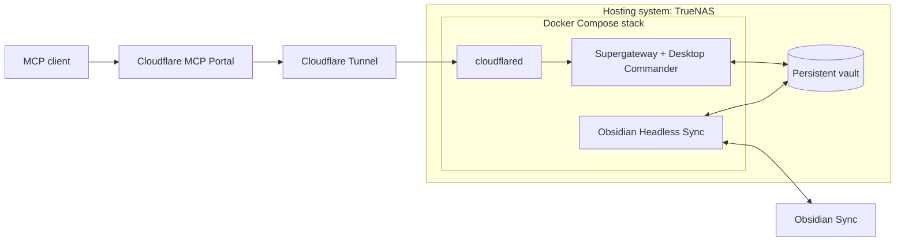

# Obsidian MCP

This repository builds my personal production stack for accessing an Obsidian Sync vault through MCP. It also serves as a reference implementation. The defaults target TrueNAS and Cloudflare MCP Portal; the component boundaries show where your deployment can make different choices.

## Architecture

**TrueNAS is the hosting system.** It runs Docker Compose and provides persistent storage, permissions, and snapshots. The containers don't depend on TrueNAS APIs.

**The Compose stack contains three services:**

- **Sync** runs the official Obsidian Headless client continuously. It synchronizes your notes and attachments between Obsidian Sync and a local `/vault` directory. Its account credentials and Sync state have a separate private mount.
- **Desktop Commander** provides file, search, and terminal tools for the same `/vault`. Supergateway runs alongside it in the container, converting stdio MCP to Streamable HTTP with bearer authentication at `/mcp` on port 8000.
- **cloudflared** connects the private MCP service to Cloudflare Tunnel. The default stack publishes no host ports.

**MCP Portal is an external aggregator.** It connects your clients to the MCP service through the tunnel and controls which tools they see. You configure Portal and Cloudflare routing outside Compose. The tunnel transports requests; Desktop Commander implements the tools.



Docker creates the vault and private state as named volumes automatically. Only the vault is shared between Sync and Desktop Commander. Each service keeps its own state and credentials. Sync runs on a separate network from the MCP service and tunnel connector.

## Adaptation points

- **Hosting:** you can run the same Compose stack on another Docker host. Docker creates the data volumes for you. Supply the token files and arrange backups and service management on your host. The TrueNAS include files are deployment helpers.
- **Aggregation:** you can replace MCP Portal with another aggregator that supports Streamable HTTP and the gateway's bearer token. Tool filtering and client access policy belong to that aggregator.
- **Direct access:** you can connect a compatible MCP client directly to the gateway through a configured tunnel route or reverse proxy. Supply the bearer token in the `Authorization` header. Without an aggregator, your authenticated client can use every tool Desktop Commander advertises. To omit Cloudflare entirely, remove `cloudflared` and provide your own route to the gateway; the default Compose file has no published port.

These choices leave the shared-vault arrangement intact. This repository keeps concrete defaults for my deployment; you can use it as a reference, but don't treat it as a dependency.

## Deployment and tools

See the [deployment guide](deploy/README.md) for token provisioning, TrueNAS installation, Obsidian authentication, and tunnel/Portal configuration. You'll find the non-secret settings in [.env.example](.env.example).

With Desktop Commander, you can read and write notes, search their contents, and store attachments. Use `write_file` to write supported image formats from base64, or `start_process` with Python or curl to store PDFs and arbitrary binary files. The gateway accepts JSON bodies up to 4 MiB. Terminal tools give access to the MCP container, so choose which tools your clients can use as part of your access policy. See [SECURITY.md](SECURITY.md) for credential boundaries and logging behavior.

## Images and development

You can pull these public images:

- `ghcr.io/glitchassassin/obsidian-mcp-sync`
- `ghcr.io/glitchassassin/obsidian-mcp-desktop-commander`

GitHub Actions builds and tests `linux/amd64` images before publishing those same images. Main pushes update `latest`; every published build receives a `sha-<full-commit>` tag; release tags such as `v0.2.0` produce matching image tags. Pull requests build and test without publishing. Use image digests when you need immutable references. You can build for other architectures locally.

```sh
docker build --target sync -t obsidian-mcp-test-sync:local .
docker build --target mcp -t obsidian-mcp-test-commander:local .
OBSIDIAN_MCP_SYNC_IMAGE=obsidian-mcp-test-sync:local \
OBSIDIAN_MCP_COMMANDER_IMAGE=obsidian-mcp-test-commander:local \
  scripts/ci-test.sh
```

Tests use disposable storage and synthetic credentials. They cover gateway authentication, file/search tools, exact-byte attachment writes, credential isolation, named-volume initialization and persistence through container recreation, and native SQLite loading. You'll need to verify live Sync transfers and external routing in your deployment. On macOS/Colima, use `TMPDIR=/private/tmp` if Docker cannot mount the default temporary directory.

The repository's scripts and configuration use the [MIT license](LICENSE). Bundled third-party software retains its own licenses and terms.
