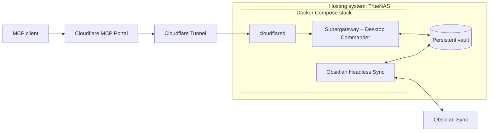

# Obsidian MCP

This repository builds my personal production stack for accessing an Obsidian Sync vault through MCP. It also serves as a reference implementation. The defaults target TrueNAS and Cloudflare MCP Portal; the component boundaries show where another deployment can make different choices.

## Architecture

**TrueNAS is the hosting system.** It runs Docker Compose and provides persistent storage, permissions, and snapshots. The application containers have no dependency on TrueNAS APIs.

**The Compose stack contains three services:**

- **Sync** runs the official Obsidian Headless client continuously. It synchronizes notes and attachments between Obsidian Sync and a local `/vault` directory. Its account credentials and Sync state have a separate private mount.
- **Desktop Commander** provides file, search, and terminal tools for the same `/vault`. Supergateway runs alongside it in the container, converting stdio MCP to Streamable HTTP with bearer authentication at `/mcp` on port 8000.
- **cloudflared** connects the private MCP service to Cloudflare Tunnel. The default stack publishes no host ports.

**MCP Portal is an external aggregator.** It connects clients to the MCP service through the tunnel and controls which tools those clients see. Portal configuration and Cloudflare routing are managed outside Compose. The tunnel transports requests; Desktop Commander implements the tools.



Only the vault is shared between Sync and Desktop Commander. Each service keeps its own state and credentials. Sync runs on a separate network from the MCP service and tunnel connector.

## Adaptation points

- **Hosting:** run the same Compose stack on another Docker host. Set `OBSIDIAN_MCP_DATA_DIR` to an absolute storage path and arrange permissions, backups, and service management there. The TrueNAS include files are deployment helpers.
- **Aggregation:** replace MCP Portal with another aggregator that supports Streamable HTTP and the gateway's bearer token. Tool filtering and client access policy belong to that aggregator.
- **Direct access:** connect a compatible MCP client directly to the gateway through a configured tunnel route or reverse proxy. Supply the bearer token in the `Authorization` header. Without an aggregator, every tool advertised by Desktop Commander is available to the authenticated client. To omit Cloudflare entirely, remove `cloudflared` and provide your own route to the gateway; the default Compose file has no published port.

These choices leave the shared-vault arrangement intact. This repository keeps concrete defaults for my deployment; it does not maintain customized stacks for other users.

## Deployment and tools

See the [deployment guide](deploy/README.md) for storage layout, TrueNAS installation, Obsidian authentication, and tunnel/Portal configuration. Non-secret settings are listed in [.env.example](.env.example).

Desktop Commander handles note reads/writes and content search. Supported images can be written from base64 with `write_file`; PDFs and arbitrary binary attachments can be stored through `start_process` using Python or curl. The gateway accepts JSON bodies up to 4 MiB. Terminal tools give access to the MCP container, so tool selection is part of the deployment's access policy. See [SECURITY.md](SECURITY.md) for credential boundaries and logging behavior.

## Images and development

Published images are public:

- `ghcr.io/glitchassassin/obsidian-mcp-sync`
- `ghcr.io/glitchassassin/obsidian-mcp-desktop-commander`

GitHub Actions builds and tests `linux/amd64` images before publishing those same images. Main pushes update `latest`; every published build receives a `sha-<full-commit>` tag; release tags such as `v0.1.2` produce matching image tags. Pull requests build and test without publishing. Use image digests when a deployment needs immutable references. Other architectures can be built locally.

```sh
docker build --target sync -t obsidian-mcp-test-sync:local .
docker build --target mcp -t obsidian-mcp-test-commander:local .
OBSIDIAN_MCP_SYNC_IMAGE=obsidian-mcp-test-sync:local \
OBSIDIAN_MCP_COMMANDER_IMAGE=obsidian-mcp-test-commander:local \
  scripts/ci-test.sh
```

Tests use disposable storage and synthetic credentials. They cover gateway authentication, file/search tools, exact-byte attachment writes, credential isolation, configuration persistence, and native SQLite loading. Live Sync transfers and external routing are deployment checks. On macOS/Colima, use `TMPDIR=/private/tmp` if Docker cannot mount the default temporary directory.

The repository's scripts and configuration use the [MIT license](LICENSE). Bundled third-party software retains its own licenses and terms.
